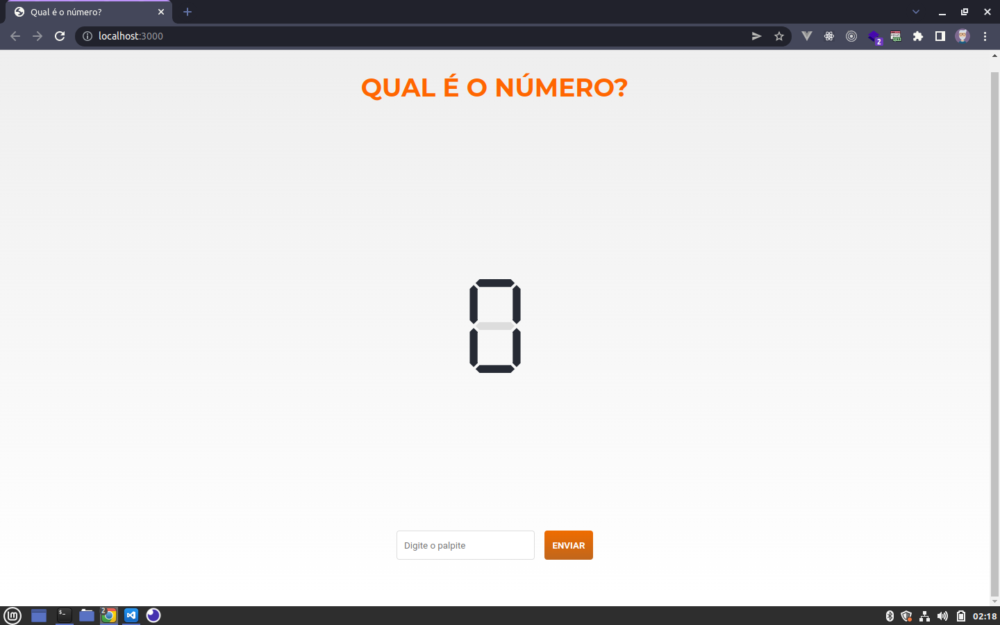
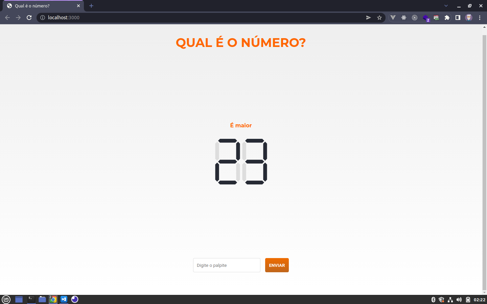
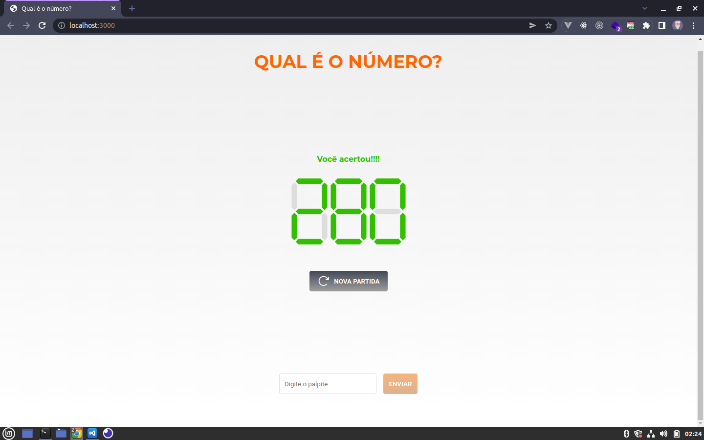
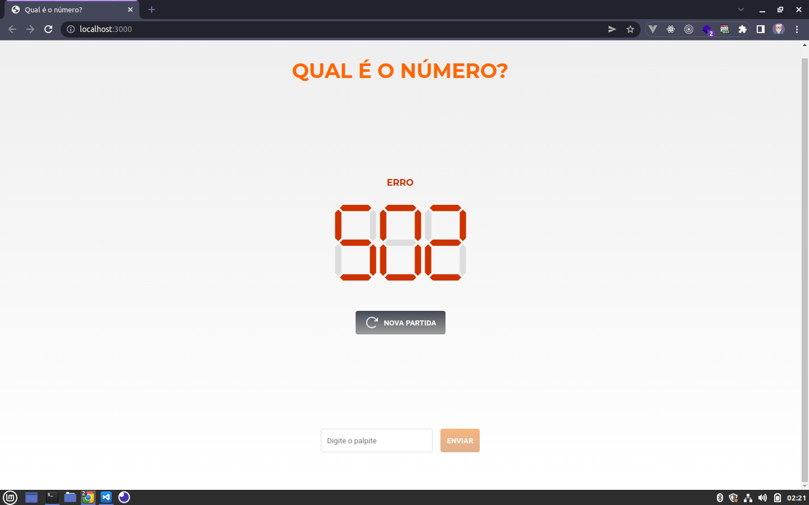

# Qual é o número?

## Objetivo

Desenvolver um jogo de advinhar o número aleatório que será retornado através de uma requisição.

## O jogo

O jogo é bem simples, vc digita um palpite e clica no botão ENVIAR.
O seu palpite aparecerá no LED de sete segmentos com uma dica acima se o número é maior ou menor que seu palpite.
Se vc advinhar o número, receberá uma mensagem informando que acertou em verde e um botão será mostrado para iniciar uma nova partida.
Pode ocorrer erro na requisição do número aleatório, se isso acontecer será informado o status code do erro em vermelho no LED e um botão será mostrado para iniciar uma nova partida.

### Tecnologias utilizadas

HTML, Javascrip e CSS

### ScreenShots

